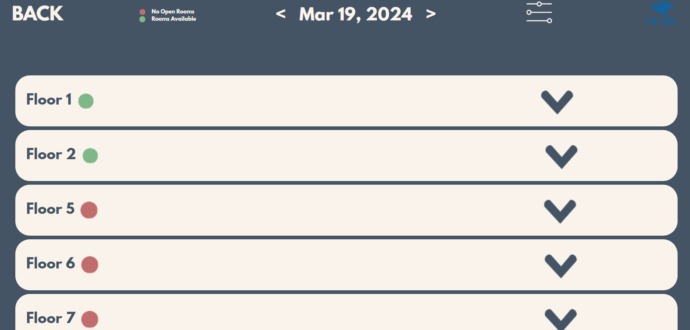

# room-booking-kiosk-mockup
This is a prototype for a user-friendly kiosk interface designed to streamline the process of booking rooms in a library. The kiosk provides an intuitive way for users to reserve study rooms, meeting spaces, and other facilities within the library. It lacks full functionality and is purely meant to be a showcasing demo.

Check it out [here](https://roombooker-mockup.netlify.app/)

## Screenshots

